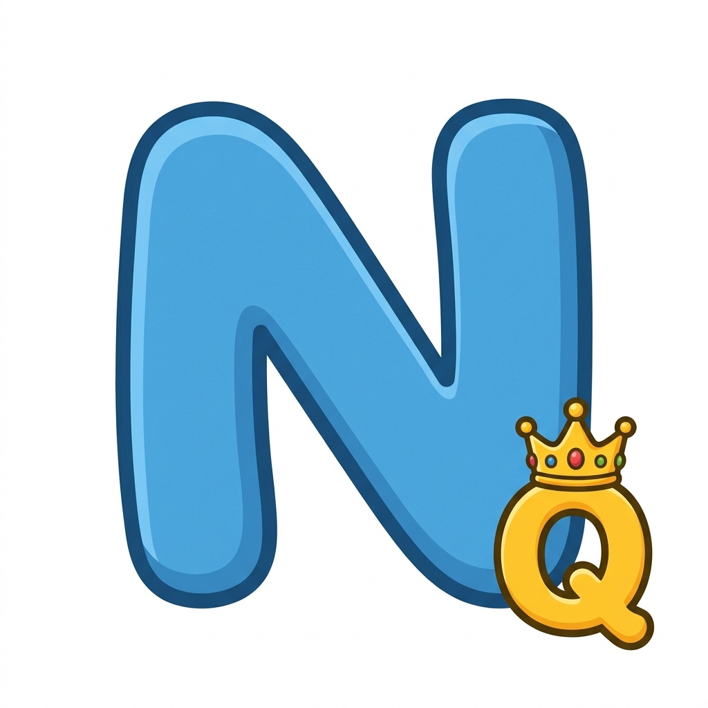

# 👑 N-Queens Puzzle Studio

A production-ready, highly aesthetic Flutter application dedicated to the legendary **N-Queens Problem**. This isn't just a solver; it's a complete ecosystem for creating, scanning, and sharing regional N-Queens puzzles with a premium "Funky Notebook" aesthetic.



---

## 🎨 Design Philosophy: "The Funky Notebook"
The application is built around a cohesive design system that blends academic nostalgia with modern micro-interactions:
- **Notebook-Line Backgrounds**: Custom `CustomPainter` rendering of classic school-line patterns.
- **Sticker-Style UI**: Tilted containers with sharp, bold drop shadows for buttons and cards.
- **Premium Typography**: A curated blend of `DynaPuff`, `Comfortaa`, and `PlaywriteUSModern` loaded directly from local assets.
- **Micro-Animations**: Extensive use of Lottie animations and Tween-based transitions.

---

## 🚀 Core Features

### 1. 🪄 AI Board Generator
Generate infinite, unique, and guaranteed-solvable puzzles. 
- **Custom Sizes**: Support for board dimensions from **4x4 up to 12x12**.
- **Randomized Regions**: Utilizes a custom flood-fill algorithm to create distinct, non-contiguous color regions around pre-calculated solution seeds.

### 2. 📸 Digital Capture & Scanning
- **Real-Time Scanning**: Integrated `mobile_scanner` for rapid QR detection.
- **Camera Digitization**: Capture physical boards (from books or magazines) and let the AI digitize them into playable puzzles.

### 3. 🔒 Secure "Funky" Sharing
The world's first **AES-256 Encrypted** N-Queens sharing ecosystem.
- **High Security**: Board data is encrypted using a hardcoded 256-bit hex key before being encoded into QR codes.
- **Ordered Selection**: Multi-select up to **7 boards** at a time with ordered selection badges.

### 4. 🧠 Pro-Grade AI Solver
- **Backtracking Algorithm**: A highly optimized recursive solver capable of finding solutions for large boards in milliseconds.
- **Visual Reasoning**: A real-time **Algorithm Log** allows users to watch the AI navigate the search tree.

### 5. 🌐 Real-Time WebRTC P2P Arena (Pure FCM Stream)
Pure Peer-to-Peer (P2P) synchronous gameplay with zero-latency updates and **zero server costs**.
- **Compete Duel Mode**: Speed-run identical puzzle decks side-by-side! A live progress capsule tracks how many queens your opponent has placed in real time.
- **Co-op Sync Mode**: Collaborate and solve the same shared board together! Taps and clears are synchronized directly across devices in under 5ms.
- **0% Polling Architecture:** Bypasses wasteful timers completely. The app connects instantly via Google FCM v1 silent data notifications and fetches signaling payloads strictly on-demand.
- **Tapped Notification Approval:** Displays a system-level dropdown notification banner even in the foreground. Tapping the banner instantly opens the **"DUEL CHALLENGE!"** accept/decline approval dialog!

---

## 📲 Android 13+ Notification Setup

To compile the push notification wake-up pipelines successfully, the app requires standard permission declarations inside `android/app/src/main/AndroidManifest.xml`:

### 1. Declared Permissions
```xml
<!-- Internet & Network State -->
<uses-permission android:name="android.permission.INTERNET"/>
<uses-permission android:name="android.permission.ACCESS_NETWORK_STATE"/>

<!-- Android 13+ High-Priority Push Notification Permission -->
<uses-permission android:name="android.permission.POST_NOTIFICATIONS"/>
```

### 2. App-Click Intent Routing
```xml
<intent-filter>
    <action android:name="android.intent.action.VIEW" />
    <category android:name="android.intent.category.DEFAULT" />
    <category android:name="android.intent.category.BROWSABLE" />
    <action android:name="FLUTTER_NOTIFICATION_CLICK" />
</intent-filter>
```

---

## 📦 Getting Started

### Prerequisites
- Flutter SDK (latest stable)
- Android Studio / VS Code
- A physical Android device (required for camera and push notification testing)

### Installation & Run
1. Install package dependencies:
   ```bash
   flutter pub get
   ```
2. Clean compiler logs and generate the workspace build:
   ```bash
   flutter clean
   flutter run
   ```

---
*Created with ❤️ for the love of logic and aesthetics.*
